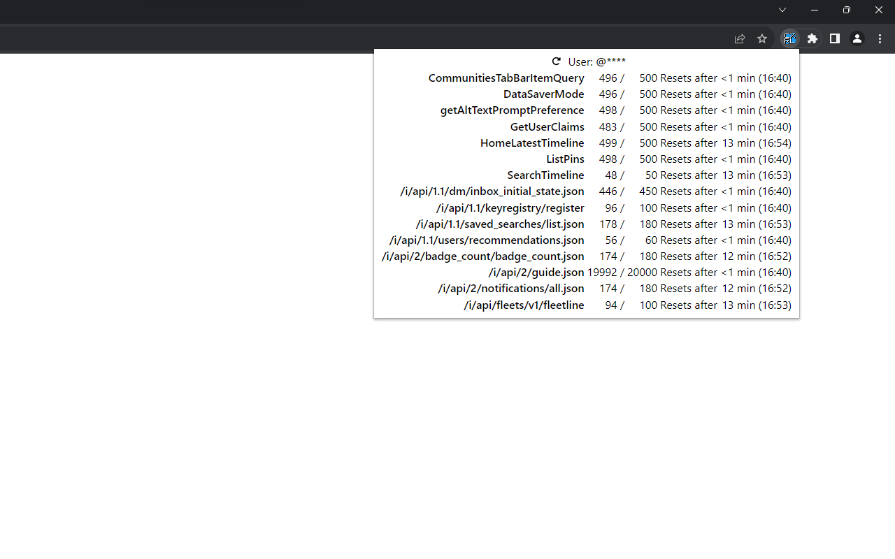

# Check X (Twitter) Rate Limits

**Check X (Twitter) Rate Limits** is a browser extension which shows API rate limit statuses of Twitter.

## Install

- [for Mozilla Firefox](https://addons.mozilla.org/ja/firefox/addon/check-x-rate-limits/)
- [for Google Chrome](https://chrome.google.com/webstore/detail/mnklaagioefjenpefkfcmlbbllfbnlmd)

## Build

Requires Node.js and Yarn v3.

1. Make sure you are at the root of the repository.
2. Run `yarn install` to install the required packages.
3. Run `yarn build` in the root directory of this repository will generate builds.
   - The build files for Firefox (MV2) are in `dist/v2/build/`.
   - The build files for Chrome (MV3) are in `dist/v3/build/`.

## Changelog

See [CHANGELOG.md](CHANGELOG.md).

## License

Released under the MIT License. See [LICENSE.txt](LICENSE.txt).
